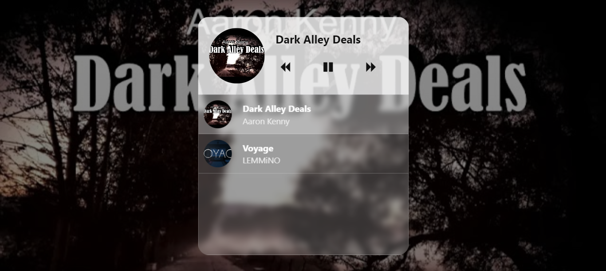
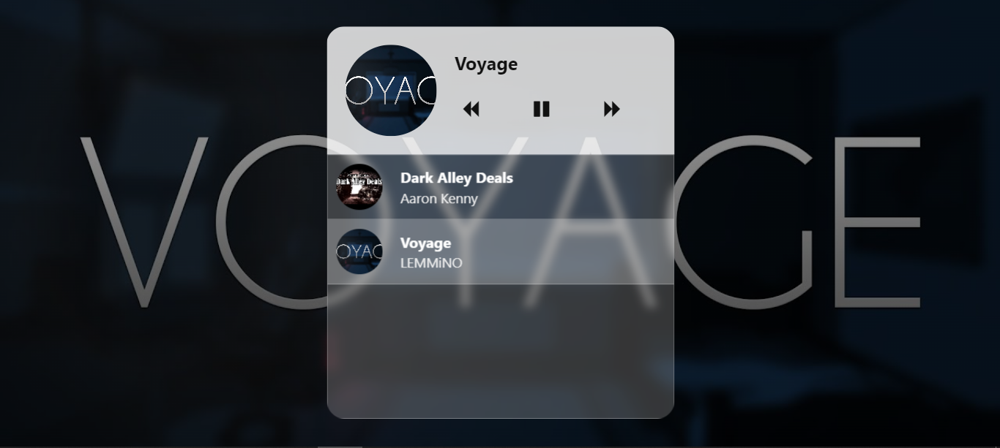
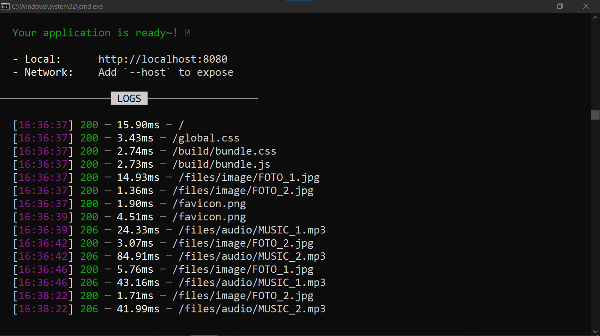

# MUSIC PLAYER COM SVELTE
👨‍🏫APP DE REPRODUÇÃO DE MUSICA ESTATICO COM SVELTE.

 <br> 
 <br> 
 <br> 

## DESCRIÇÃO:
Este aplicativo Svelte é um reprodutor de música simples, projetado para proporcionar uma experiência de audição agradável e intuitiva. Com um layout visualmente cativante, oferece uma seção dedicada à exibição da música atualmente em reprodução, completa com imagens de capa e detalhes do artista. Os controles de reprodução são facilmente acessíveis, permitindo ao usuário pausar, reproduzir e avançar para a próxima faixa com facilidade. Além disso, uma lista de músicas disponíveis está pronta para ser explorada, possibilitando ao usuário escolher entre uma variedade de opções musicais.

## FUNCIONALIDADES:
1. **Reprodução de músicas**: Ele permite a reprodução de uma lista de músicas. Quando a página é carregada, a primeira música da lista é reproduzida automaticamente.

2. **Controle de reprodução**: O usuário pode pausar e retomar a reprodução da música atual clicando em um botão de play/pause.

3. **Navegação entre músicas**: O usuário pode navegar entre as músicas da lista clicando nos botões de avançar e retroceder.

4. **Seleção de música**: O usuário pode selecionar uma música da lista clicando nela. Isso altera a música atual para a música selecionada na lista.

## EXECUTANDO O PROJETO:
1. **Instalar as dependências do projeto**:
   - Execute o comando no diretório `CODIGO/`:
     ```cmd
     npm install
     ```
   Este comando instala todas as dependências listadas no arquivo `package.json` do seu projeto. 

2. **Executando o Aplicativo:**
   - Ainda no diretório `CODIGO/`, abra o terminal ou prompt de comando e digite o seguinte comando:
   ```bash
   npm run dev
   ```
   - Acesse o aplicativo no navegador visitando `http://localhost:8080/`.

3. **Usando o APP:**
   1. Para reproduzir/pausar a música atual, clique no botão de reprodução/pausa.
   2. Para avançar ou retroceder na lista de músicas, clique nos botões de avançar ou retroceder.
   3. Para selecionar uma música específica da lista, clique nela na lista de músicas disponíveis.

4. **Gerenciando o `musiclist.js`:**
   Para gerenciar o `musiclist.js` em `./CODIGO/src` e garantir que as imagens e músicas estejam corretamente vinculadas, você precisa garantir que os caminhos especificados no `musiclist.js` correspondam aos diretórios corretos onde os arquivos de mídia são armazenados.

   Considerando que as imagens são armazenadas em `CODIGO\public\files\image` e as músicas em `CODIGO\public\files\audio`, você pode atualizar o `musiclist.js` da seguinte forma:

   ```javascript
   import { writable } from 'svelte/store';

   export const musicList = writable([
      { 
      image: "FOTO_1.jpg",
      audio: "MUSIC_1.mp3",
      name: "Dark Alley Deals",
      artist: "Aaron Kenny"
    },
    { 
      image: "FOTO_2.jpg",
      audio: "MUSIC_2.mp3",
      name: "Voyage",
      artist: "LEMMiNO"
    },
      // Adicione mais músicas conforme necessário
   ]);
   ```

   Certifique-se de substituir `FOTO_1.jpg`, `FOTO_2.jpg`, `MUSIC_1.mp3` e `MUSIC_2.mp3` pelos nomes reais dos arquivos de imagem e música que você tem em seus diretórios correspondentes.

   Com esta configuração, o aplicativo Svelte usará os arquivos de mídia corretos para exibir imagens e reproduzir músicas de acordo com a lista definida em `musicList`. Se adicionar mais mídias, basta incluí-las na lista, seguindo o mesmo formato.

## SOBRE O COPYRIGHT (PIRATARIA):
   - É importante ressaltar que todas as músicas presentes no meu projeto são de "No Copyright Music". Esta é uma categoria específica de música que está disponível para uso público sem infringir direitos autorais. 

   - Ao utilizar músicas de "No Copyright Music", você estou garantindo que não estou violando as leis de direitos autorais e não estou sujeito a processos legais relacionados à pirataria de conteúdo protegido por direitos autorais.

   - As músicas fornecidas no meu projeto, como "Dark Alley Deals" de Aaron Kenny e "Voyage" de LEMMiNO, são exemplos de faixas que pertencem a essa categoria. Elas podem ser utilizadas livremente em projetos pessoais e comerciais, sem a necessidade de obter permissão ou pagar royalties aos artistas.

   - É fundamental deixar claro que não me responsabilizo pela pirataria ao utilizar músicas no meu projeto. Isso significa que, apesar de ter selecionado cuidadosamente músicas que estão disponíveis como "No Copyright Music", não posso garantir que:

   1. Os usuários não irão utilizar o aplicativo de forma indevida para acessar músicas protegidas por direitos autorais de outras fontes.

   2. As músicas fornecidas como "No Copyright Music" permanecerão nessa categoria indefinidamente, pois os status de licenciamento de músicas podem mudar ao longo do tempo.
   
## NÃO SABE?
- Entendemos que para manipular arquivos em `HTML`, `CSS` e outras linguagens relacionadas, é necessário possuir conhecimento nessas áreas. Para auxiliar nesse aprendizado, oferecemos cursos gratuitos disponíveis:
* [CURSO DE HTML E CSS](https://github.com/VILHALVA/CURSO-DE-HTML-E-CSS)
* [CURSO DE JAVASCRIPT](https://github.com/VILHALVA/CURSO-DE-JAVASCRIPT)
* [CURSO DE NODEJS](https://github.com/VILHALVA/CURSO-DE-NODEJS)
* [CURSO DE SVELTE](https://github.com/VILHALVA/CURSO-DE-SVELTE)
* [CONFIRA MAIS CURSOS](https://github.com/VILHALVA?tab=repositories&q=+topic:CURSO)

## CREDITOS:
- [PROJETO FEITO PELO VILHALVA](https://github.com/VILHALVA)
- [VEJA O VIDEO DESSE PROJETO](https://youtu.be/EhYzHu-8wNk?si=ORemBy80dpf3gS_u)
- [VEJA A PLAYLIST DE PROJETOS](https://youtube.com/playlist?list=PLVGpQnv1Jm4zF85nLVJU2hvqg3CBa6QQd&si=64Ou6dIY4dYhOlEd)


